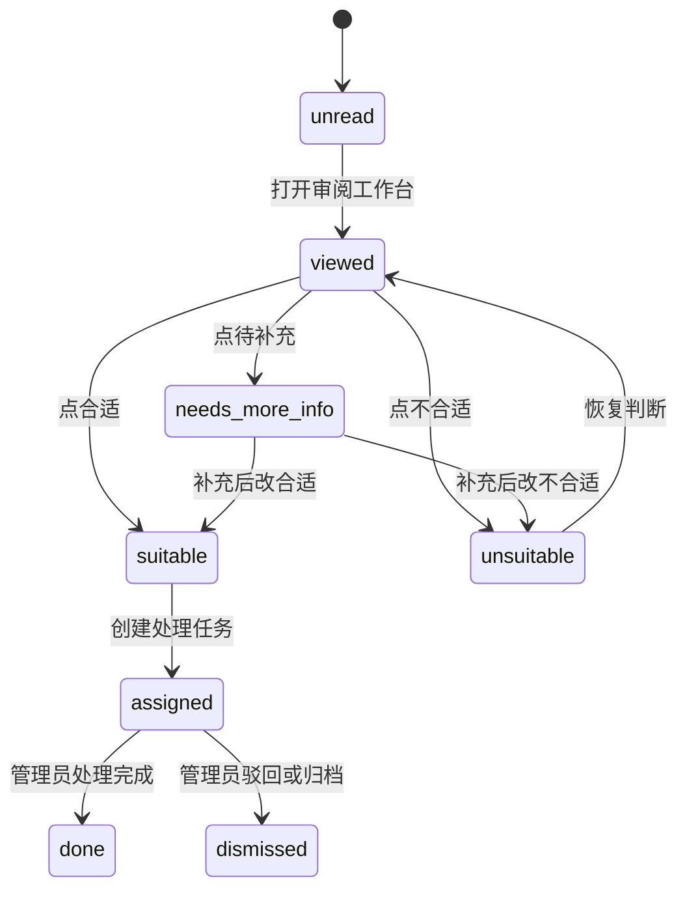

# 简历审阅工作台与登录后界面改版设计

## 背景

当前重构版 `hr-agent` 已经具备控制面 API、简历领域服务、飞书登录与权限设计草案，但前端仍是占位页。用户希望登录后页面更舒服、筛选更强、简历查看不再依赖长页面上下滚动，并支持已看/未看、合适/不合适、合适简历自动进入管理员处理队列。

本设计聚焦登录后的简历库与审阅体验，不修改三平台自动化处理逻辑，不改变候选人会话处理规则。

## 服务器只读调研结论

已按只读方式访问服务器，没有修改任何服务器文件或服务。

- `http://218.244.142.84/` 当前渲染为“货运物流查询”页面，不是招聘后台。
- `http://218.244.142.84:8080/` 与 `/index.html` 返回 `401 Unauthorized`，响应头包含 `WWW-Authenticate: Basic realm="RecruitAgent"`。
- 使用用户提供的 `Administrator / renheng@123` 尝试访问 8080 未通过鉴权。
- 因此，旧招聘后台的真实入口需要后续确认。本文设计基于用户明确提出的招聘后台使用目标与重构版现有代码结构，不假设 80 端口物流查询页就是旧招聘后台。

## 参考方向

本设计参考以下开源项目和设计模式：

- shadcn-admin: 后台骨架、侧边栏、命令搜索、数据密集布局。
- TailAdmin: React/Tailwind 管理后台的指标区、表格页、表单页组织方式。
- shadcn/ui Data Table 与 TanStack Table: 排序、筛选、列显示、行选择、分页、批量操作。
- React-PDF / React PDF Viewer: 简历 PDF 固定视窗预览、页码跳转、缩放。
- OpenCATS: ATS 候选人流程、状态流转、候选人池设计。

设计取向是企业内部运营工具：安静、密集、稳定、可快速判断，避免营销式首页、大幅装饰图和卡片堆叠。

## 目标

- 登录后根据飞书用户身份展示不同菜单、不同简历范围。
- 简历列表支持更丰富的筛选、排序、分页、批量处理。
- 点击“查看”后进入固定布局的审阅工作台，不再通过长页面滚动看简历。
- 支持用户级已看/未看状态，不同用户互不影响。
- 支持合适/不合适/待补充等审核结论，并记录原因标签和备注。
- 普通筛选人员点“合适”后，简历自动进入管理员或指定负责人处理队列。
- 保持权限、审阅状态、分配队列、简历数据边界清晰，不把功能混在同一张旧表里。

## 非目标

- 不在本阶段重做三平台消息处理规则。
- 不在本阶段新增真实飞书通知推送，先做站内队列。
- 不在本阶段做复杂审批流。
- 不在本阶段把所有历史旧页面一次性完整迁移。
- 不把权限只做在前端，后端 API 必须强制校验。

## 推荐方案

采用“简历审阅工作台”作为登录后的核心页面。

整体信息架构：

```text
/login
/app/resumes              简历库
/app/resumes/review       简历审阅工作台
/app/review-queue         待我处理
/app/review-queue/suitable 合适待复核
/app/automation           自动化控制
/app/monitoring           监控与决策日志
/app/interview            面试中心
/app/settings/users       用户与权限
```

普通用户登录后默认进入 `/app/resumes`。如果用户只有简历库权限，则只显示简历库和待我处理，不显示自动化、规则、系统设置。

## 登录后整体布局

使用固定 AppShell：

```text
顶部栏：
  左侧：当前模块标题 / 全局搜索
  右侧：当前用户、角色、可见范围、退出登录

左侧栏：
  简历库
  待我处理
  合适待复核
  不合适归档
  批量导入
  面试中心
  自动化控制
  监控
  设置

主内容：
  根据路由显示列表、工作台、队列或设置页
```

侧边栏根据 `/api/auth/me` 返回的 `permissions` 渲染。后端仍要在每个 API 做权限校验，不能依赖前端隐藏菜单。

## 简历库列表页

列表页目标是快速筛选和批量处理。

页面结构：

```text
状态分组：
  全部 / 未看 / 已看 / 待判断 / 合适 / 不合适 / 待补充 / 待我处理

筛选区：
  常用筛选直接展示，高级筛选放入抽屉

表格区：
  候选人 / 岗位 / 平台 / 负责人 / 评分 / 学历 / 专业 / 城市 / 状态 / 更新时间 / 操作

批量操作条：
  批量标记已看 / 批量不合适 / 批量分配 / 批量导出
```

默认排序：

1. 未看优先。
2. 待判断优先。
3. 高评分优先。
4. 最近入库优先。

每行操作：

- 查看
- 标记已看
- 合适
- 不合适
- 分配

“查看”打开审阅工作台，不跳转到需要长滚动的详情页。

## 筛选条件

第一版建议支持以下筛选：

| 筛选项 | 说明 |
| --- | --- |
| 查看状态 | 未看、已看 |
| 审核状态 | 未判断、合适、不合适、待补充、已分配 |
| 负责人 | 和新红、宋峰峰等 owner |
| 平台 | BOSS、51job、智联 |
| 岗位 | 按岗位规则分组 |
| 评分等级 | A、B、C、D |
| 分数区间 | 最低分、最高分 |
| 学历 | 大专、本科、硕士等 |
| 专业 | 文本搜索或标准化专业 |
| 城市 | 当前城市、期望城市 |
| 年龄 | 区间筛选 |
| 性别 | 男、女、未知 |
| 工作年限 | 区间筛选 |
| 简历状态 | 待解析、已解析、解析失败 |
| 附件状态 | 有附件、无附件、已下载 |
| 来源时间 | 今日、近 3 天、近 7 天、自定义 |
| 关键词 | 姓名、手机号、学校、公司、技能 |
| 去重状态 | 唯一、疑似重复 |

筛选区需要支持“保存筛选视图”，例如：

- 今日未看高分简历
- 宋峰峰 BOSS 待判断
- 51job 已下载待复核
- AI 岗合适候选人

## 简历审阅工作台

工作台是本次改版的核心。

打开方式：

- 从列表点击“查看”。
- 从队列点击候选人。
- 从快捷键或下一份按钮进入下一条。

布局：

```text
┌──────────────────────────────────────────────────────────────┐
│ 顶部：候选人姓名 / 岗位 / 平台 / 评分 / 状态 / 返回列表       │
├───────────────┬─────────────────────────┬────────────────────┤
│ 左侧候选列表  │ 中间简历预览             │ 右侧审阅面板       │
│ 当前筛选结果  │ PDF 页码、缩放、文本视图 │ 摘要、评分、聊天   │
│ 可切上一位    │ 不滚整页，只滚预览内部   │ 操作按钮固定可见   │
├───────────────┴─────────────────────────┴────────────────────┤
│ 底部固定操作条：已看 / 合适 / 不合适 / 待补充 / 下一份       │
└──────────────────────────────────────────────────────────────┘
```

中间预览区：

- PDF 简历固定高度显示。
- 支持上一页、下一页、页码跳转。
- 支持放大、缩小、适应宽度。
- 如果没有 PDF，则显示解析文本。
- 文本视图按“基本信息、教育经历、工作经历、项目经历、技能”分块。

右侧审阅面板：

- 候选人摘要。
- 岗位匹配结论。
- JD 打分证据。
- 来源平台与负责人。
- 最近聊天记录。
- 下载与解析状态。
- 历史审核记录。
- 操作区固定在底部，不随内容滚走。

这样用户判断一份简历时，不需要在详情页上下找按钮，也不会因为看简历翻页丢失右侧判断上下文。

## 已看与未看

已看/未看是用户级状态。同一份简历，A 用户已看不代表 B 用户已看。

新增表：

```text
resume_review_states
  id
  user_id
  resume_id
  read_status              unread / viewed
  viewed_at
  decision                 undecided / suitable / unsuitable / needs_more_info
  reason_tags_json
  note
  assigned_to
  created_at
  updated_at
```

规则：

- 用户第一次打开审阅工作台时，写入或更新 `read_status=viewed` 与 `viewed_at`。
- 用户可手动改回未看。
- 列表默认展示当前用户的阅读状态。
- 管理员可以查看所有人的阅读状态汇总。

## 合适与不合适

审核状态建议如下：

```text
undecided       未判断
viewed          已看但未判断
suitable        合适
unsuitable      不合适
needs_more_info 待补充
assigned        已分配
```

点“合适”时：

- 弹出轻量确认层。
- 必选或建议选择原因标签。
- 可填写备注。
- 写入 `resume_review_states.decision=suitable`。
- 创建一条分配任务到管理员或指定负责人。

点“不合适”时：

- 必选或建议选择原因标签。
- 写入 `decision=unsuitable`。
- 从默认待看队列中移除。
- 保留在“不合适归档”，仍可搜索与恢复。

原因标签建议：

合适：

- 岗位匹配
- 经验匹配
- 学历可接受
- 行业相关
- 技能匹配
- 需要优先约面

不合适：

- 地点不接受
- 薪资不匹配
- 工作年限不符
- 专业不符
- 经验方向不符
- 简历信息不足
- 沟通意愿弱

## 合适队列与分配

新增表：

```text
resume_assignments
  id
  resume_id
  from_user_id
  assigned_to_user_id
  status                  pending / accepted / done / dismissed
  source_decision_id
  note
  created_at
  updated_at
```

流转：

```text
普通用户点合适
  -> 写审核状态 suitable
  -> 创建 assignment 给管理员
  -> 管理员在“待我处理”看到
  -> 管理员决定约面、继续沟通、归档或打回
```

第一版不做真实飞书推送，只做站内队列。后续可在 assignment 创建后追加飞书通知。

## 权限与可见范围

继续沿用飞书登录 RBAC 设计。

关键原则：

- `super_admin` 看全部。
- 普通用户只看授权 owner/platform 范围内的简历。
- 初筛人员只看到简历库和自己的处理队列。
- 面试官只看到被分配给自己的合适简历。
- 未归属历史简历默认只给管理员看，避免泄露。

简历列表和详情必须同时做后端权限过滤：

```text
GET /api/resumes
GET /api/resumes/{id}
GET /api/resumes/{id}/review-context
POST /api/resumes/{id}/review-decision
```

不能只靠前端筛选。

## API 设计

新增或扩展 API：

```text
GET  /api/auth/me

GET  /api/resumes
GET  /api/resumes/{resume_id}
GET  /api/resumes/{resume_id}/review-context
POST /api/resumes/{resume_id}/view
POST /api/resumes/{resume_id}/review-decision

GET  /api/resume-review/queue
POST /api/resume-review/assignments/{assignment_id}/accept
POST /api/resume-review/assignments/{assignment_id}/done
POST /api/resume-review/assignments/{assignment_id}/dismiss

GET  /api/resume-saved-views
POST /api/resume-saved-views
PATCH /api/resume-saved-views/{view_id}
DELETE /api/resume-saved-views/{view_id}

POST /api/resumes/bulk-review
```

`GET /api/resumes` 参数建议：

```text
page
pageSize
q
readStatus
decision
owner
platform
jobType
scoreGrade
scoreMin
scoreMax
education
major
city
ageMin
ageMax
gender
experienceYearsMin
experienceYearsMax
parseStatus
attachmentStatus
dateFrom
dateTo
dedupStatus
sort
desc
```

`GET /api/resumes/{id}/review-context` 返回：

```json
{
  "resume": {},
  "reviewState": {},
  "assignment": {},
  "score": {},
  "scoreEvidence": [],
  "conversation": {
    "sessionId": "",
    "messages": []
  },
  "artifact": {
    "filePath": "",
    "parseStatus": ""
  },
  "permissions": {
    "canReview": true,
    "canAssign": true,
    "canRescore": false
  }
}
```

`POST /api/resumes/{id}/review-decision` 请求：

```json
{
  "decision": "suitable",
  "reasonTags": ["岗位匹配", "需要优先约面"],
  "note": "沟通积极，建议复核",
  "assignTo": "admin-user-id"
}
```

## 前端组件拆分

建议新增前端目录时保持职责清楚：

```text
frontend/src/app/
  AppShell.tsx
  routes.tsx

frontend/src/features/auth/
  LoginPage.tsx
  authApi.ts
  useCurrentUser.ts
  PermissionGate.tsx

frontend/src/features/resumes/
  ResumeLibraryPage.tsx
  ResumeReviewWorkbench.tsx
  ResumeFilterBar.tsx
  ResumeAdvancedFilterDrawer.tsx
  ResumeTable.tsx
  ResumePreviewPane.tsx
  ResumeTextView.tsx
  CandidateSummaryPanel.tsx
  ReviewActionBar.tsx
  SavedFilterViews.tsx
  resumeApi.ts
  resumeTypes.ts

frontend/src/features/review-queue/
  ReviewQueuePage.tsx
  AssignmentList.tsx
  reviewQueueApi.ts

frontend/src/components/ui/
  button.tsx
  table.tsx
  drawer.tsx
  dialog.tsx
  tabs.tsx
  badge.tsx
  select.tsx
```

原则：

- 简历列表、简历预览、审核动作、分配队列分开。
- PDF 预览只负责显示文件，不负责审核状态。
- 审核状态只走 review API，不直接混入简历编辑 API。
- 权限判断通过 `PermissionGate` 与后端 API 双保险实现。

## 后端模块拆分

建议在现有 FastAPI 结构上新增：

```text
app/domain/resume_review/
  models.py
  repository.py
  service.py
  filters.py
  assignments.py

app/api/routes/resume_review.py
app/api/routes/resume_saved_views.py
```

职责：

- `models.py`: 审核状态、分配任务、保存视图模型。
- `repository.py`: 读写审核状态、视图、分配任务。
- `filters.py`: 将 API 筛选参数转成 repository 查询条件。
- `service.py`: 审阅状态流转、已看/未看、合适/不合适。
- `assignments.py`: 合适队列创建与处理。

现有 `app/api/routes/resumes.py` 保持简历基础 CRUD，不承载审核队列逻辑。

## 数据库设计

新增表：

```text
resume_review_states
resume_review_events
resume_assignments
resume_saved_views
```

`resume_review_events` 用于审计：

```text
id
resume_id
user_id
event_type       viewed / decision_changed / assigned / note_updated
before_json
after_json
created_at
```

这样可以追踪谁看过、谁标记合适、谁改成不合适。

迁移要求：

- 幂等创建新表。
- 不破坏现有 `resumes` 数据。
- 初始状态不回填为已看，所有历史简历对普通用户默认视为未看。
- 未归属简历默认不进入普通用户范围。

## 状态流转



## 交互细节

- 列表页筛选条件变化后立即刷新，但需要防抖，避免频繁请求。
- 工作台打开后自动标记已看，但不自动做合适/不合适。
- 右侧操作按钮始终可见。
- 做合适/不合适后自动跳到下一份，减少重复点击。
- 操作失败时保留当前候选人，不跳下一份。
- 如果简历 PDF 不存在，显示解析文本和下载状态。
- 如果解析失败，显示失败原因和重新解析入口。
- 如果用户无权审核，只显示只读详情，不显示操作按钮。

## 视觉规范

建议风格：

- 背景：浅灰白工作台背景。
- 主色：专业蓝，用于主按钮和选中状态。
- 状态色：绿色代表合适，红色代表不合适，黄色代表待补充，灰色代表已看。
- 表格密度：中等偏紧凑，适合运营快速扫。
- 卡片圆角不超过 8px。
- 避免大面积渐变、装饰球、营销式 hero。
- 重要操作使用固定操作条，不藏在页面底部。
- 图标使用 lucide 或 shadcn 组件体系，不使用 emoji 当结构图标。

## 分阶段实施计划

### Phase A: 入口确认与基础壳

- 确认旧招聘后台真实入口和当前部署方式。
- 保留旧服务只读，不直接覆盖。
- 搭建新前端 AppShell。
- 接入 `/api/auth/me`。
- 根据权限渲染菜单。

### Phase B: 简历库列表

- 实现 `GET /api/resumes` 增强筛选。
- 实现列表页状态分组。
- 实现高级筛选抽屉。
- 实现保存筛选视图。
- 实现批量选择和批量操作入口。

### Phase C: 审阅工作台

- 实现三栏固定布局。
- 实现 PDF/文本预览。
- 实现右侧候选人摘要、评分证据、聊天记录。
- 实现底部固定操作条。
- 打开工作台自动写已看。

### Phase D: 审核状态与分配队列

- 新增审核状态表和事件表。
- 实现合适、不合适、待补充。
- 实现合适后自动进入管理员队列。
- 实现管理员待处理页。

### Phase E: 权限与灰度

- 将所有相关 API 接入权限和 scope 校验。
- 做不同角色的端到端验证。
- 先灰度部署到新路径。
- 确认稳定后替换旧入口。

## 测试计划

后端测试：

- 未登录访问简历列表返回 401。
- 无权限访问他人 owner 简历返回 403 或过滤为空。
- 普通用户只能看到授权 owner/platform。
- 打开简历写入当前用户的已看状态。
- A 用户已看不影响 B 用户未看。
- 点合适会创建 assignment。
- 点不合适不会创建 assignment。
- 批量标记只作用于当前用户有权限的简历。
- 保存筛选视图只能读写自己的视图。

前端测试：

- 不同权限用户菜单不同。
- 筛选参数能正确映射到 URL 或 API query。
- 工作台不需要整页滚动即可完成查看和判断。
- PDF 缺失时能回退文本视图。
- 合适/不合适失败时不跳到下一份。
- 列表和工作台状态同步。

验收命令建议：

```text
pytest tests
ruff check .
python -m compileall app scripts run_control_plane.py run_worker.py
```

前端若引入构建系统，再补充：

```text
npm run lint
npm run build
```

## 风险与待确认点

- 需要确认旧招聘后台真实入口。当前 80 端口是物流查询，8080 鉴权未通过。
- 需要确认“合适简历直接弄到我这边”的目标接收人，是固定管理员，还是按岗位/owner 分配。
- 需要确认不同员工的数据范围，尤其是 owner、platform、岗位三种维度如何组合。
- 需要确认历史简历没有 owner/platform 归属时是否只给管理员看。
- 需要确认是否要第一版就做飞书消息通知。建议第一版先做站内队列，通知后置。
- 需要确认 PDF 预览文件路径和访问鉴权方式，避免附件直链越权。

## 成功标准

- 用户登录后只看到自己有权限的简历和菜单。
- 简历列表能用多条件快速筛选。
- 查看简历时不再需要页面整体上下滚动。
- 用户能在同一个工作台完成看简历、看评分、看聊天、标记合适/不合适。
- 已看/未看状态按用户独立记录。
- 合适简历能自动进入管理员处理队列。
- 后端权限和数据范围校验完整，不能通过直接请求 API 越权查看。
